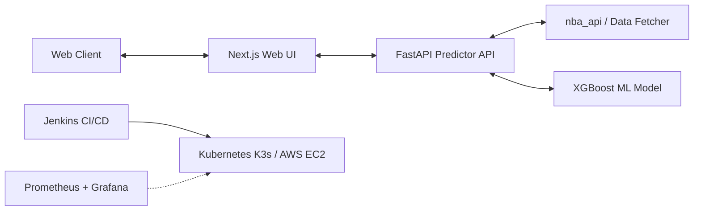

# 🏀 NBA Matchup Prediction & Diagnostic Engine

An enterprise-grade, full-stack predictive machine learning application designed to ingest real-time NBA team statistics, run matchup simulations, and diagnose prediction metrics.

---

## 🧠 System Architecture



---

## 🚀 Key Features

* **Interactive Matchup Predictor:** Select any two NBA teams to simulate a matchup and view win probabilities, scoring predictions, and team comparison stats.
* **XGBoost Machine Learning Classifier:** Powered by a tuned XGBoost classifier trained on historical regular-season team momentum, rolling performance averages, and home-court parameters.
* **Modern Next.js Dashboard:** Built with React 18, Next.js, and TypeScript, featuring sleek card designs, interactive state selections, and animated loading screens.
* **Production Observability:** Full monitoring stack running Prometheus and Grafana to track Kubernetes resource allocations, Kubelet metrics, and API latency.
* **GitOps CI/CD Automation:** Automated Jenkins pipeline with **Smart Auto-Failover** support:
  1. Attempts standard deployment on AWS K3s.
  2. Falls back to lightweight Docker Compose on EC2 if Kubernetes limits are hit.
  3. Falls back to a local Docker container run exposed via a secure public tunnel.
* **One-Click Deployment & Teardown:** Automated shell scripts to deploy (`demo_launcher.sh`) or completely destroy (`destroy.sh`) all AWS resources and local containers in a single command.

---

## 🧰 Technology Stack

### Core Frontend & UI
* **Framework:** React, Next.js 14, TypeScript
* **Styling:** CSS3 variables, flexbox/grid layout systems, high-fidelity responsive design
* **Data Flow:** RESTful API integrations

### Machine Learning & Backend API
* **Engine:** FastAPI (Python 3.10)
* **Model:** XGBoost Classifier, Scikit-Learn (dynamic feature engineering and scaling)
* **Data Sources:** `nba_api` (live scoreboard and logs integration), Pandas, Pickle

### Infrastructure & Operations
* **Orchestration:** K3s (Lightweight Kubernetes), Docker, Docker Compose
* **IaC:** Terraform (AWS EC2 provisioning)
* **CI/CD:** Jenkins (declarative pipeline runner)
* **Observability:** Prometheus & Grafana dashboard

---

## ⚙️ Quick Start

### Prerequisites
- Node.js (v18+)
- Python (v3.10+)
- Docker & Docker Compose
- AWS CLI configured (if deploying to cloud)

### 1. Manual Local Execution
To run the application locally on your host machine:

#### Step 1.1: Start the Backend API
```bash
pip install -r requirements.txt
python agent_logic.py
```
*The API will start at `http://localhost:8000`.*

#### Step 1.2: Start the Frontend UI
```bash
cd frontend
npm install
npm run dev
```
*Access the Web UI at `http://localhost:3000`.*

---

## 🏗️ Automated Infrastructure Orchestration

### One-Click Launch
To bootstrap the entire stack on AWS (via Terraform and K3s Kubernetes) along with the local Prometheus/Grafana observability monitors, ensure your environment keys are set and run:
```bash
# Set your AWS credentials
export AWS_ACCESS_KEY_ID="your_key"
export AWS_SECRET_ACCESS_KEY="your_secret"

# Run the launcher
./demo_launcher.sh
```

### One-Click Teardown (Nuclear option)
To cleanly stop all local containers, terminate the AWS EC2 instance, and clear all active SSH tunnels:
```bash
./destroy.sh
```

---

## 🤖 CI/CD with Jenkins
The repository includes a parameterized `Jenkinsfile` and `Jenkinsfile.destroy` that automates build, registry push, auto-failover deployments, and email logging report notifications. See [`automation_instructions.md`](./automation_instructions.md) for step-by-step CI/CD setup.
